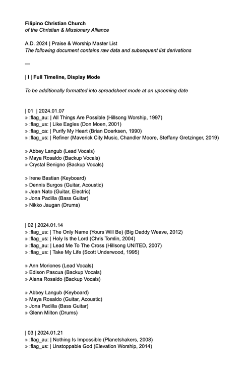
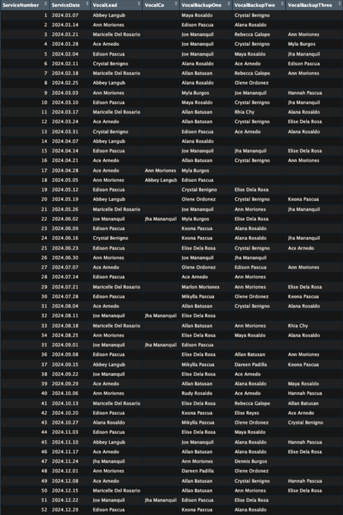
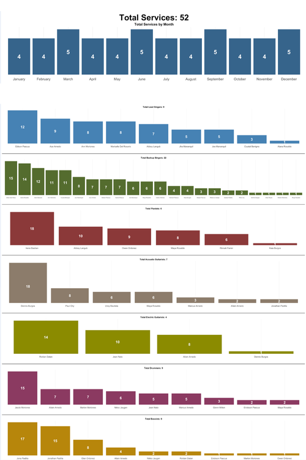
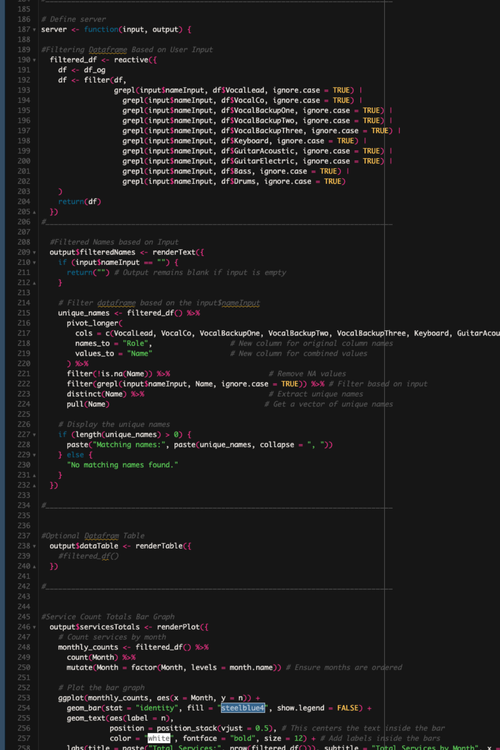

<h1>Worship Service Data Analysis: Trends and Insights (2025) - <a href="https://moriojac.shinyapps.io/my_app/">Project Link</a> </h1>

<h2>Description</h2>
This Shiny interactive application is a personal project for my local church, designed to explore and visualize worship service trends and statistics from 2024. By offering insights into service participation, musical roles, and song selections, it enables leaders to make informed decisions, identify patterns, and appreciate the contributions of musicians and vocalists.
 

<h2>Languages and Utilities Used</h2>

- <b>R</b> 
- <b>ggplot</b>
- <b>Shiny</b>

 
 

  <h1>Project Process</h1>

<table width="100%" style="table-layout: fixed;">
  <tr>
    <td align="center" valign="top" width="25%">
      

        
        <b>Data Collection</b>
          
        

          For this project, I received a 41-page Word document detailing 52 worship services in 2024, including the songs performed, vocalists, and instrumentalists for each service.
        

      

    </td>
    <td align="center" valign="top" width="25%">
      

        
        <b>Data Cleaning and Preparation</b>
        

           
          With the mix of manual organizing and the help of AI tools, all data from the Word document detailing 52 worship services was extracted and transferred to a CSV file.
        

      

    </td>
    <td align="center" valign="top" width="25%">
      

        
        <b>Data Visualization & Storytelling</b>
        

           
          Data is manipulated into several visualizations, categorized into two sections:
             <b>Worship Service Insights:</b> Allows users to search by name to access a compiled overview of their service contributions.
              <b>Musician Leaderboard:</b> Showcases the top musicians for each musical role.
        

      

    </td>
    <td align="center" valign="top" width="25%">
      

        
        <b>Interpretation & Decision-Making</b>
        

           
          The goal of this data is to provide insights into worship service participation, allowing users to explore trends and recognize contributions within the music ministry.
           Insights from the data can help worship leaders make informed decisions, such as balancing musician rotations, identifying frequently played songs, and recognizing key               contributors to each service
        

      

    </td>
  </tr>
</table>
